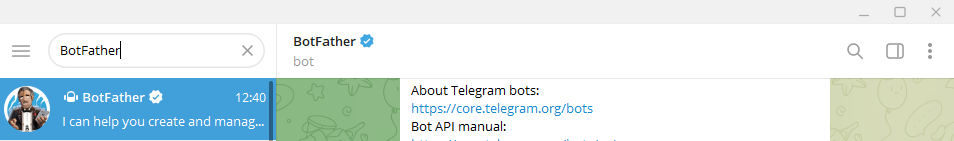

# Instalando o BOS - Balance Of Satoshi

## Tutorial Minibolt-Balance-of-satoshi

Ele servirá para fazer o rebalanceamento de seus canais de forma simples. Vamos às etapas.

- Primeiro clone o BOS no github utilizando o código abaixo:

```shell
git clone https://github.com/pagcoinbtc/miniboltfullauto.git
```

Acesse o diretório:

```shell
cd miniboltfullauto
```

Comece a instalação pelo script para instalar o BoS:

```shell
chmod +x likeabos.sh
```

depois

```shell
./likeabos.sh
```

Ao final da instalação você precisa recarregar a sessão. Pode ser feita de duas formas.

- usando o comando abaixo:

  ```shell
  . ~/.profile
  ```

- ou, saindo da sessão e logando novamente.

## Criando o Bot- Telegram

Próximo passo é criar um Bot no telegram, para auxiliar no monitoramento do Nó por ele.
Se você não tiver o telegram, vá na play store do seu celular e baixe o app ou instale no seu pc.

Após fazer os cadastros e estar ativo. Vá na pesquisa e digite BotFather, aparecerá diversos bots, cuidado precisa ser o certificado.

criador de bot (https://t.me/BotFather)

> 

Utilize o comando abaixo, no telegram, para gerar um novo bot.

```shell
/newBot
```

Dê um nome para o seu Bot e um nome de usuário ex. ´SatsBot´.

_sugestão: você pode usar o nome de seu nó como nome de usuário._

Ele fornecerá uma mensagem, como abaixo:

> Done! Congratulations on your new bot. You will find it at t.me/
> SatsBot. You can now add a description, about section and
> profile picture for your bot, see /help for a list of commands.
> By the way, when you've finished creating your cool bot, ping our
> Bot Support if you want a better username for it. Just make sure >the bot is fully operational before you do this.

Use this token to access the HTTP API:

Ex. >`3245675437:BBHSj5cQB2XUJG7VmTP8Yjed-trA9QM0vlA`

> Keep your token secure and store it safely, it can be used by anyone to control your bot.
> For a description of the Bot API, see this page: [https://core.telegram.org/bots/api]

Siga os passos para a criação de um bot no telegram, após o término da cópia da "API HTTP", ela será necessária para o próximo passo.

Adicione ao terminal o código abaixo:

```shell
bos telegram
```

Ele etregará uma mensagem parecida com essa.

> (node:162475)
> [DEP0050 DeprecationWarning: The `punycode` > module is deprecated. Please use a userland alternative instead.
> (Use `node --trace-deprecation ...` to show where the warning was created)  
> ? Enter Telegram bot API key

Insira a API que você gerou no terminal e pressione enter. Você não verá nenhum número aparecer.

`3245675437:BBHSj5cQB2XUJG7VmTP8Yjed-trA9QM0vlA`

retorne ao Telegram e envie o comando abaixo:

```shell
/start
```

Ele dará como resposta um código de conexão e uma mensagem.

> Ele vai te responder algo como: "🤖 O código de conexão é: 1463539065"

Faça,

```shell
chmod +x bos-autostart.sh
```

e

```shell
./bos-autostart.sh

```

Adicione o código gerado ao seu terminal

> connecting_to_telegram:
> (empty array)
> ? Connection code? (Bot command: /connect) 23789514

estará configurado
Ao final, basta pressionar `Ctrl + C` para voltar ao terminal.

Pronto o BoS está pronto para ser usado no telegrama, mas também uma feramenta de terminal que pode ser usada com o comando

```shell
bos help
```
